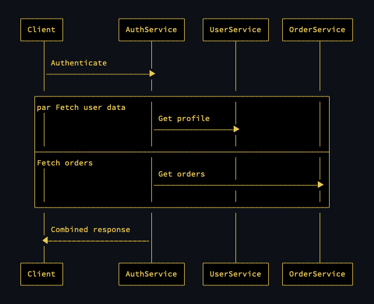

# beautiful-mermaid-py

Pure Python, single-file Mermaid -> ASCII/Unicode renderer.
This project was vibe-coded by porting the TypeScript ASCII renderer from `https://github.com/lukilabs/beautiful-mermaid/tree/main/src/ascii` into one Python file.

## What it does

- Renders Mermaid diagrams to text (Unicode box drawing by default, optional pure ASCII).
- Supported diagram types:
  - Flowcharts / stateDiagram-v2 (grid + A* pathfinding)
  - sequenceDiagram
  - classDiagram
  - erDiagram

## Example:

The image below is the ASCII/Unicode output generated for that sample.



Here’s the Mermaid source that produced the image:

```
sequenceDiagram
  participant C as Client
  participant A as AuthService
  participant U as UserService
  participant O as OrderService
  C->>A: Authenticate
  par Fetch user data
    A->>U: Get profile
  and Fetch orders
    A->>O: Get orders
  end
  A-->>C: Combined response
```

## Usage

Render a Mermaid text file:

```bash
python3 beautiful_mermaid.py path/to/diagram.mmd
```

ASCII-only mode:

```bash
python3 beautiful_mermaid.py path/to/diagram.mmd --ascii
```

Tuning layout spacing:

```bash
python3 beautiful_mermaid.py diagram.mmd --padding-x 5 --padding-y 5 --box-padding 1
```

## CLI options

- `--ascii` Use ASCII characters instead of Unicode box drawing
- `--padding-x` Horizontal spacing between nodes (default: 5)
- `--padding-y` Vertical spacing between nodes (default: 5)
- `--box-padding` Padding inside node boxes (default: 1)

## Library use (optional)

You can also import and call it directly:

```python
from beautiful_mermaid import render_mermaid_ascii

output = render_mermaid_ascii("""
  graph LR
    A --> B --> C
""")
print(output)
```

Note: the module is a single file named `beautiful_mermaid.py`.


## License

Original TypeScript Project Author of https://github.com/lukilabs/beautiful-mermaid:
Copyright (c) 2026 Luki Labs, MIT License. See `LICENSE`.
Python Version was written by Codex, Code Curator: Michael Christen
Happy Vibe Coding!
